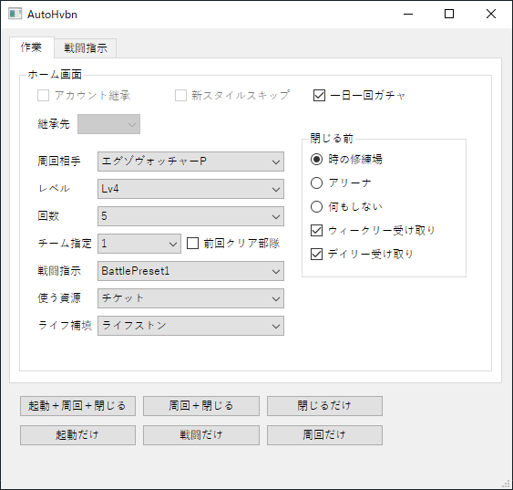

## AutoHvbn(オートヘブバン)

AutoHvbn is a tool to complete daily quest for the game "Heaven Burns Red" (ヘブンバンズレッド).

### Usage

There are 6 buttons in the bottom of the UI

1. Full Sequence - From launching the application to close.
2. Spend stamina and close - Spend stamina on the specified stage and close after completion.
3. Close only - Redeem the daily quest reward and close the application.
4. Start only - Start the application.
5. Battle only - Only execute the battle script specified in the option (Scripts can be defined in the second tab).
6. Spend stamina only - Only spend stamina on the specified stage and stay in the home screen.

### Options

Account inherite （アカウント継承）- coming soon\
Skip new style intro (新スタイルスキップ) - coming soon\
Daily free gacha (一日一回ガチャ) - handle if daily free gacha is available, skip if unchecked.\

Specified stage (周回相手) - specify the enemy while spending stamina.\
Level (レベル) - specify the level of the enemy.\
Times (回数) - specify the how many stamina you want to spend on the enemy.\
Specified team (チーム指定) - specify the team you want to use.\
Last cleared team (前回クリア部隊) - will click the button to use last cleared team in record (built-in function of the game)\
Battle script (戦闘指示) - specify the battle script you want to use.\
Resource (使う資源) - specify the resource you want to use.\
Resource to fill life (ライフ補填) - specify the resource you want to use to fill life.
